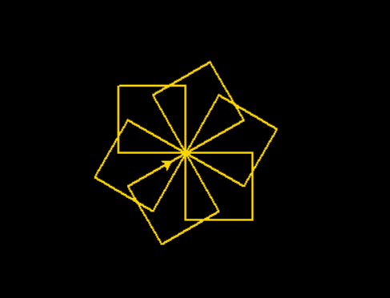
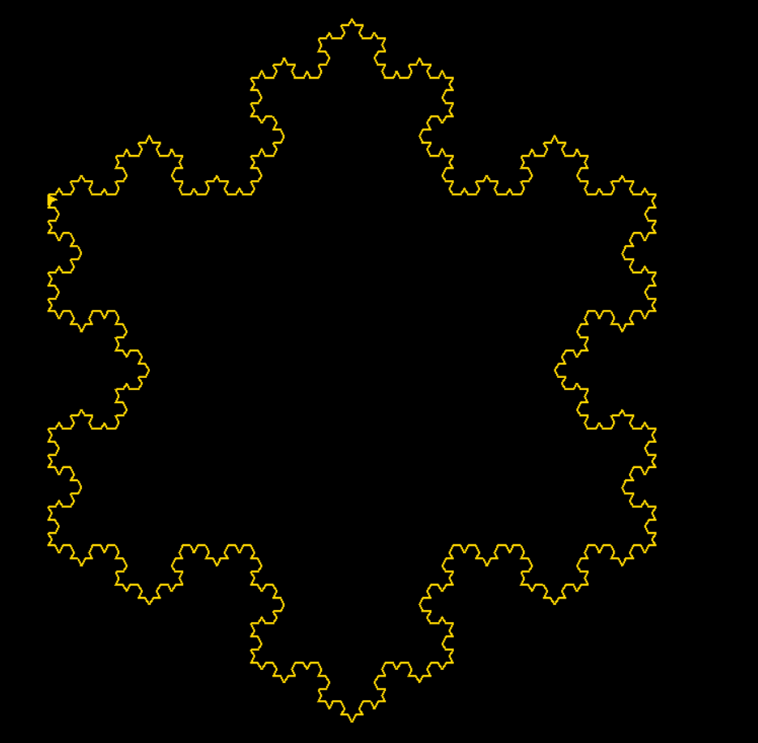
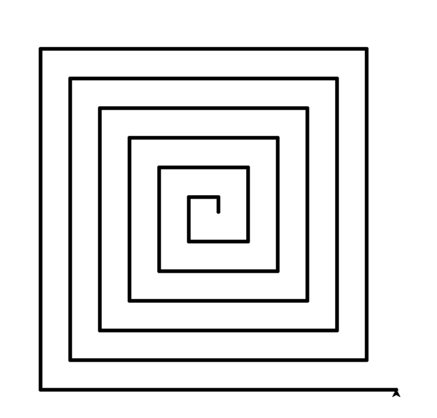
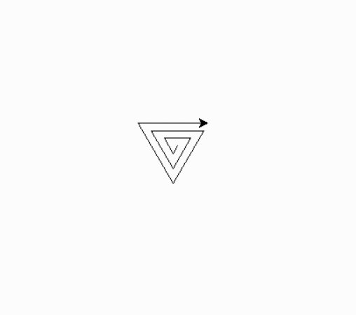

# Fractal - Turtle

### Aplicação Simples Usando Fractal e Turtle

<p  align="justify">  Fractal é uma figura geométrica que se repete em diferentes escalas, formando uma estrutura complexa. Turtle é uma ferramenta de programação que permite desenhar figuras geométricas na tela do computador com comandos simples. A turtle pode ser usada para criar imagens fractais, que são construídas a partir de padrões repetitivos programados com comandos de movimento da turtle.
</p>

### 
<p align="justify">
Para iniciar precisamos instalar a biblioteca chamada Python Turtle pelo Python Packets do Pycharm
</p>
#### Aqui estão alguns exemplos de Fractal 

>  Fractal de uma Árvore Colorida
```javascript
import turtle

turtle.bgcolor("black")
arv = turtle.Turtle()
arv.pensize(2)
arv.color("green")
arv.left(90)
arv.backward(100)
arv.speed(200)

def drawTree(i):
    if i < 10:
        print("Inside")
        return
    else:
        print("outside")
        arv.forward(i)
        arv.color("magenta")
        arv.circle(2)
        arv.color("brown")
        arv.left(30)
        drawTree(3*i/4)
        arv.right(60)
        drawTree(3*i/4)
        arv.left(30)
        arv.backward(i)

drawTree(100)
turtle.done()
```
<!--Target-->
<p align="center">

</p>

>  Meu Fractal agora usando  "for" para gerar um quadrado ao invés de um triângulo como no floco de neve
```javascript
import time
import turtle

# Config. screen
WIDTH, HEIGHT = 1600, 900
screen = turtle.Screen()
screen.setup(WIDTH, HEIGHT)
screen.screensize(2*WIDTH, 2*HEIGHT)
screen.bgcolor('black')
screen.delay(0)

# Config. Turtle
trig = turtle.Turtle()
trig.pensize(2)
trig.speed(1)
trig.setpos(-WIDTH // 6, HEIGHT // 6)
trig.color('gold')

# L-system
generation = 5
axiom = 'F++F++F'
chr_1, rule_1 = 'F', 'F-F++F-F'
# chr_2, rule_2 = 'G', 'GG'
step = 600
angle = 60


def apply_rules(axiom):
    return ''.join([rule_1 if chr == chr_1 else chr for chr in axiom])

# def get_result(generation, axiom):
#     for gen in range(generation):
#         axiom = apply_rules(axiom)
#     return axiom


for gen in range(generation):
    turtle.pencolor('white')
    turtle.goto(-WIDTH // 2 + 60, HEIGHT // 2 - 100)
    turtle.clear()
    turtle.write(f'Geração: {generation}', font=('Arial', 60, "normal"))

    trig.setheading(0)
    trig.goto(-WIDTH // 6, HEIGHT // 6)
    trig.clear()

    length = step / pow(3, gen)

    for chr in axiom:
        if chr == chr_1:
            for _ in range(4):
                trig.forward(length)
                trig.right(90)
        elif chr == '+':
            trig.right(angle)
        elif chr == '-':
            trig.left(angle)

    axiom = apply_rules(axiom)

screen.exitonclick()


```
<!--Target-->
<p align="center">

</p>


>  Fractal Floco de Neve
```javascript
import time
import turtle

#Config. screen
WIDTH, HEIGHT = 1600, 900
screen = turtle.Screen()
screen.setup(WIDTH, HEIGHT)
screen.screensize(2*WIDTH, 2*HEIGHT)
screen.bgcolor('black')
screen.delay(0)


#Config. Turtle
trig = turtle.Turtle()
trig.pensize(2)
trig.speed(1)
trig.setpos(-WIDTH // 6, HEIGHT // 6)
trig.color('gold')

# L-system
generation = 5
axiom = 'F++F++F'
chr_1, rule_1 = 'F', 'F-F++F-F'
# chr_2, rule_2 = 'G', 'GG'
step = 600
angle = 60


def apply_rules(axiom):
    return ''.join([rule_1 if chr == chr_1 else chr for chr in axiom])

# def get_result(generation, axiom):
#     for gen in range(generation):
#         axiom = apply_rules(axiom)
#     return axiom


for gen in range(generation):
    turtle.pencolor('white')
    turtle.goto(-WIDTH // 2 + 60, HEIGHT // 2 - 100)
    turtle.clear()
    turtle.write(f'Geração: {generation}', font=('Arial', 60, "normal"))

    trig.setheading(0)
    trig.goto(-WIDTH // 6, HEIGHT // 6)
    trig.clear()

    length = step / pow(3, gen)

    for chr in axiom:
        if chr == chr_1:
            trig.forward(length)
        elif chr == '+':
            trig.right(angle)
        elif chr == '-':
            trig.left(angle)

    axiom = apply_rules(axiom)

screen.exitonclick()
```
<!--Target-->
<p align="center">

</p>


>  Espiral Quadrado
```javascript

import turtle

turtle.pensize(5)

for i in range(0,500,20):
    turtle.forward(i)
    turtle.left(90)

turtle.Screen().exitonclick()

```
<!--Target-->
<p align="center">

</p>


>  Triângulo Espiral
```javascript


import turtle

n = 10
pen = turtle.Turtle()
for i in range(n * 3):
    pen.forward(i * 10)

    pen.right(120)

turtle.done()
```
<!--Target-->
<p align="center">

</p>

## Feliz 2023 :)
